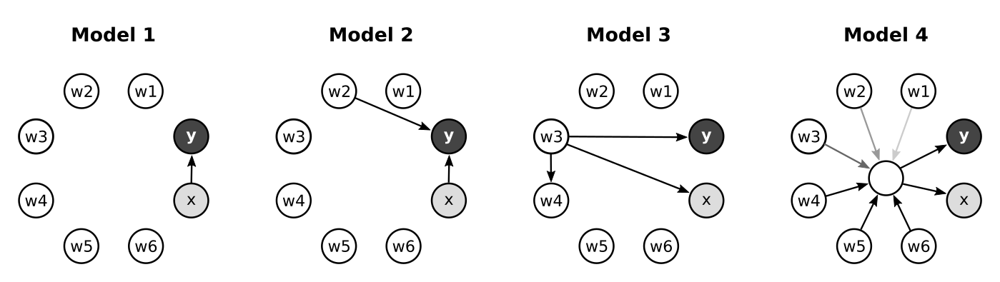

## Introduction

Structured datasets often consist of tables with observations recorded
as rows and variables encoded in columns. Let's assume that two of the
recorded variables, say `x` and `y`, are of particular interest. A typical
data-science tasks might then be: are the two variables related?

A straightforward approach to this problem is to compute the correlation
between `x` and `y`, for example using `cor.test`. This is informative,
but it opens follow-up questions such as: do other factors play a
role in the relationship? Such follow-up questions are important because
they can influence discussions or possible causation mechanisms driving
the correlation. They can also influence subsequent data-collection and
analysis efforts.

Studying relations between multiple variables can be approached using
multiple linear regression. A guide to the use and interpretation of
multiple linear regression models is summarized, for
example, in a [Points of Significance column](http://www.nature.com/nmeth/journal/v12/n12/full/nmeth.3665.html).

In R, such models are accessible through the `lm` and `glm` functions.
These tools build one model at a time, but in practice it
is often useful to explore data using several models. The `famr` package
thus provides a set of wrappers and visualization tools to analyze
families of related multiple regression models. 

Let's look at some examples that expose the functionality of the package.


## Results

This section presents a series of examples based on the generative models
below.

{width=100%}

In each diagram, circles indicate random variables and arrows reveal
causal relations. In model 1, for example, variables `w1` through
`w6` as well as `x` are independent; values of variable `y`
are determined by `x` (plus noise). Together, the models cover some of the
common relationships encountered in multivariate datasets. 

All the analyses rely on the `famr` package. Let's load it now. 

```{r}
library(famr)
```


### Example 1 - simple correlation


To begin, let's load toy dataset `mrdata1` (it is bundled with the package).

```{r}
data(mrdata1)
head(mrdata1, 3)
```

This object is a data frame 8 columns. As before, let's assume that `x`
and `y` are of particular interest and use the other
variables, i.e. `w1` through `w6`, as auxiliary data.

A `famr` analysis of this a dataset consists of a single command

```{r}
family1 = famr(mrdata1, "y", "x")
```

This specifies our dataset and the two variables of interest. A preview of
the output reveals that multiple regression has been performed using a
family of seven related models. 

```{r}
family1
```

Before digging into the structure of the output object, let's visualize
its contents using `plot`.

```{r, fig.width=4, fig.height=3, out.width="50%", dpi=200}
plot(family1, main="Dataset 1")
```

This shows the raw values for the modeled variables. We see that there is
a linear relation between them. The red line is a single-variable linear
regression that models `y` given `x`.

But recall that the `famr` analysis also contains auxiliary models.
In those models, `y` is hypothesized to depends on `x`
as well as one of the auxiliary fields, i.e. `w1`-`w6`. An overview of
the results is available through `summary`.

```{r}
summary(family1)
```

The first line describes the single-variate linear regression. In this case,
the p-value associated with the `x`-dependency is around `1e-14`. The other
rows in the summary describe models with additional terms. The primary
p-value refers to the contribution of `x` to `y`. The secondary p-value
refers to the auxiliary fields.

The package provides a tool to visualize these dependencies.

```{r, fig.width=4, fig.height=3, out.width="50%", dpi=200}
plot(family1, type="pvalues", main="Dataset 1")
```

The axes here display log-transformed p-values. The
multi-variate models that contain a dependency on `x` and another variable
contribute one point each. The base single-variate model, which does not
contain a secondary variable, is shown as a vertical line. In this case,
all the points are very close to the line and none is associated with a
significant p-value.

The conclusion of this analysis might be that `y` and `x` are correlated
and that none of the auxiliary variables participate in this relationship.
Indeed, this is consistent with generative model 1. 

For the next examples, it will be convenient to draw both diagrams at the
same time. So let's define a wrapper function.

```{r}
## wrapper for two famr plots (scatter, pvalues)
plotSP = function(family, ...) {
  par(mfrow=c(1,2))
  plot(family, type="scatter", ...)
  plot(family, type="pvalues", ...)  
}
```


### Example 2 - multi-variate correlation

For the next example, let's load and analyze a related dataset, `mrdata2`.

```{r, fig.width=8, fig.height=3, out.width="100%", dpi=200}
data(mrdata2)
family2 = famr(mrdata2, "y", "x")
plotSP(family2, main="Dataset 2")
```

The scatter diagram (left) again suggests a linear relation between `y`
and `x`. In addition to the thick red line, the diagram also shows some
gray lines. They represent fits of the multivariate models. These lines
were also present in the earlier example, but were not visible behind the
red line. Here, some of the multivariate models seem to impact the gradient
between `y` and `x`. 

The p-value diagram (right) is markedly different from before. One of the
points, labeled `w2`, lies far from the vertical line. The fact that this
point has a significant vertical coordinate suggests that variable `w2` is
correlated with `y`. The fact that including `w2` improves the significance of
`x` in the model suggests that `x` and `w2` are independent and both
relevant to modeling `y`. Indeed, this is the structure of generative model 2.


### Example 3 - non-causative correlation

The next example uses dataset `mrdata3`.

```{r, fig.width=8, fig.height=3, out.width="100%", dpi=200}
data(mrdata3)
family3 = famr(mrdata3, "y", "x")
plotSP(family3, main="Dataset 3")
```

The scatter diagram (left) again shows a correlations between `x` and `y`. However, two of the multivariate models produce fits that are almost flat. These fits suggests that given knowledge of two of these auxiliary variables, the dependency of `y` and `x` disappears.

The p-value diagram (right) leads us toward a similar conclusion. Two of the
points fall to the far left of the baseline model. This suggests that
including either `w3` or `w4` in a model de-emphasizes the importance of `x`.

Given that we identified these new interesting variable, we can
investigate further using `famr`, switching focus onto `w3`.

```{r, fig.width=8, fig.height=3, out.width="100%", dpi=200}
family3b = famr(mrdata3, "y", "w3")
plotSP(family3b, main="Dataset 3, focus on w3")
```

The results here are consistent with the generative model 3.


### Example 4 - mixed dependencies

While the previous examples demonstrated some clear-cut examples, some
patterns  may be more subtle to interpret. The next example, `mrdata4`,
goes in this direction.

```{r, fig.width=8, fig.height=3, out.width="100%", dpi=200}
data(mrdata4)
family4 = famr(mrdata4, "y", "x")
plotSP(family4, main="Dataset 4")
```

This output appears similar to example 1. The single-variate regression on
the left-hand side seems to fit the data well and the alternate
models do not greatly affect the gradient. The p-value diagram on the
right does not point to a single variable that might improve or
refute the model. However, the dots near the vertical line show some scatter.

We can take this as an opportunity to investigate the data further and to
use another feature of the package. Instead of using a default set of
alternative models, we can customize that family. To do that, we first
build defining the default family.

```{r}
models = famrModels(mrdata4, avoid=c("x", "y"))
models[1:2]
```

The first command inspects the data frame and define alternative models based
on the columns in this data frame. The second argument suggests not to
include the variables `x` and `y`; those are part of the base model.
The output object `models` is just a list. Its formating is verbose, but
the benefit is that can augment the `models` object in several ways.

A new alternative model might be to include more than one secondary variable.

```{r}
models[["w4w5"]] = list(w4="w4", w5="w5")
```

The above creates a model called `w4w5` that will contribute two terms to
the multivariate regression.

Another alternative model might use a predefined combination of existing
fields. We can implement that using a model based on a custom function.

```{r}
f456 = function(x) {
  -x[,"w4"]+x[,"w5"]+0.5*x[,"w6"] 
}
models[["w456"]] = list(w456=f456)
```

The combination of variables in the function seems ad-hoc at this stage,
but let's carry on and see what happens. In the second line, the
function is set as part of a custom model.

We can now launch the `famr` analysis with our custom model family.

```{r, fig.width=8, fig.height=3, out.width="100%", dpi=200}
family4b = famr(mrdata4, "y", "x", models)
plotSP(family4b, main="Dataset 4, with custom model family")
```

We see additional components on the plots corresponding to the new
alternative models. Variable `w456` (defined by applying function `f456`
on the dataset) greatly reduces the importance of `x`. As
in the previous example, this is a suggestion to investigate further. In
particular, we can perform a `famr` analysis focusing on `y` and `f456`.
(Note the modified syntatx using a list as the third parameter).

```{r, fig.width=8, fig.height=3, out.width="100%", dpi=200}
family4c = famr(mrdata4, "y", list(w456=f456))
plotSP(family4c, main="Dataset 4, focus on w456")
```

The base model now fits better than before. The p-value diagram suggests
we migth try to add `w3` into the model next. 


### Example 5 - categorical data

The final example uses a dataset `mrdata5` with categorical fields. 

```{r}
data(mrdata5)
head(mrdata5, 3)
```

We see that `w5` and `w6` consist of factors. However, we can proceed
with `famr` analysis as before.

```{r, fig.width=8, fig.height=3, out.width="100%", dpi=200}
family5 = famr(mrdata5, "y", "x")
plotSP(family5, main="Dataset 5")
```

The interpretation of the these plots is by now familiar. On the right hand
side, two of the points are far from the baseline model and indicate that
including a new variable to a great extent explains away the correlation
between `x` and `y`. In this case, the two points correspond to factors from
the categorical column `w5`. 

Indeed, this dataset was produced in a similar manner to example 3, whereby
both `x` and `y` were generated independently from values of `w5`.


## Discussion

The `famr` package provides wrappers and extensions to R's linear modeling
and plot functions. These wrappers provide a means to test relations
between variables of interest while automatically considering alternative
models in the background. 

A possible practical application is during explorative stages of data
analysis. Automatic testing families of related models can suggest
alternative relations between variables. Many dynamic systems with complex interactions, for example biological gene expression, are known to
create [correlations between unrelated components](http://journals.plos.org/ploscompbiol/article?id=10.1371/journal.pcbi.1002240). The package provide tools to perform tests for such effects in an automated and seamless fashion. 


## Appendix

```{r}
sessionInfo()
```